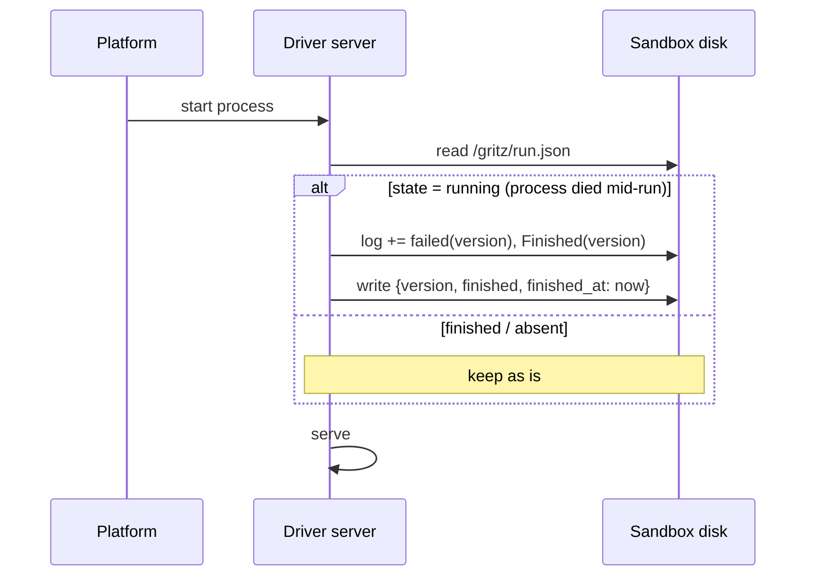
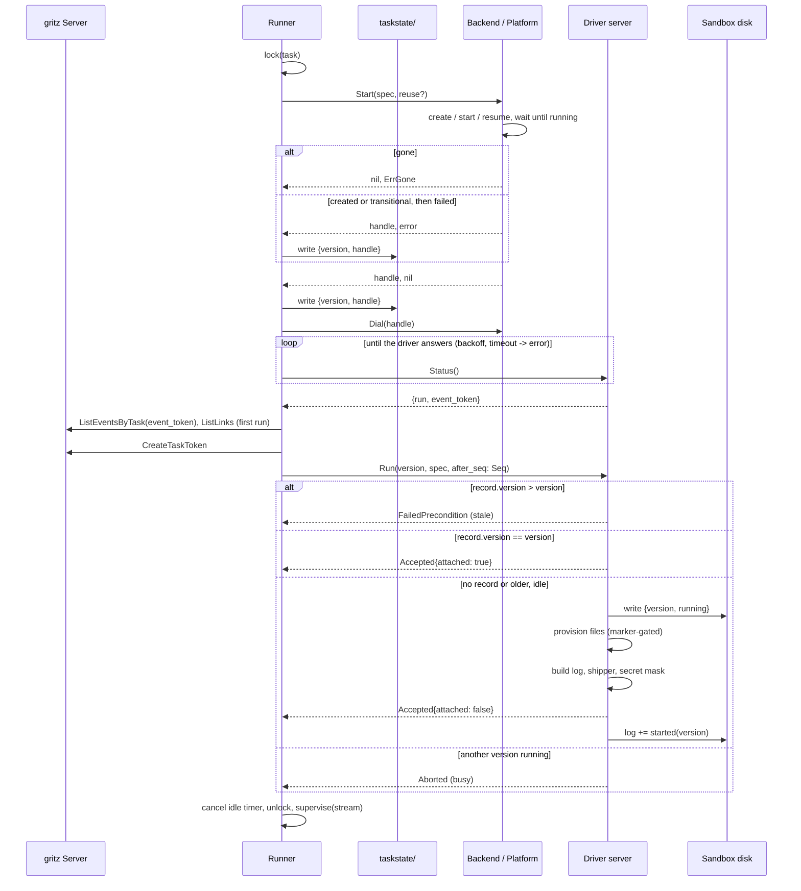
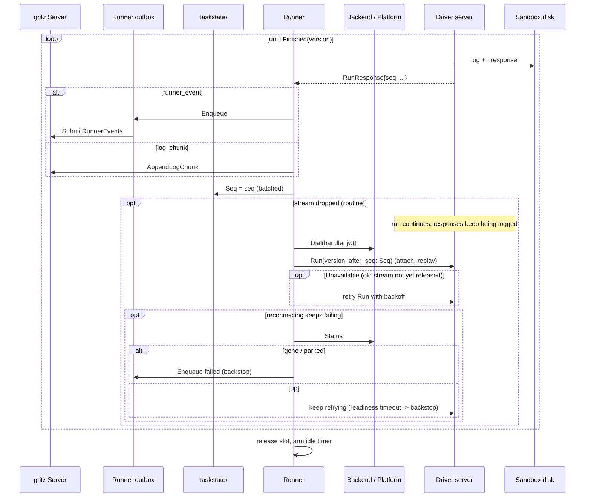
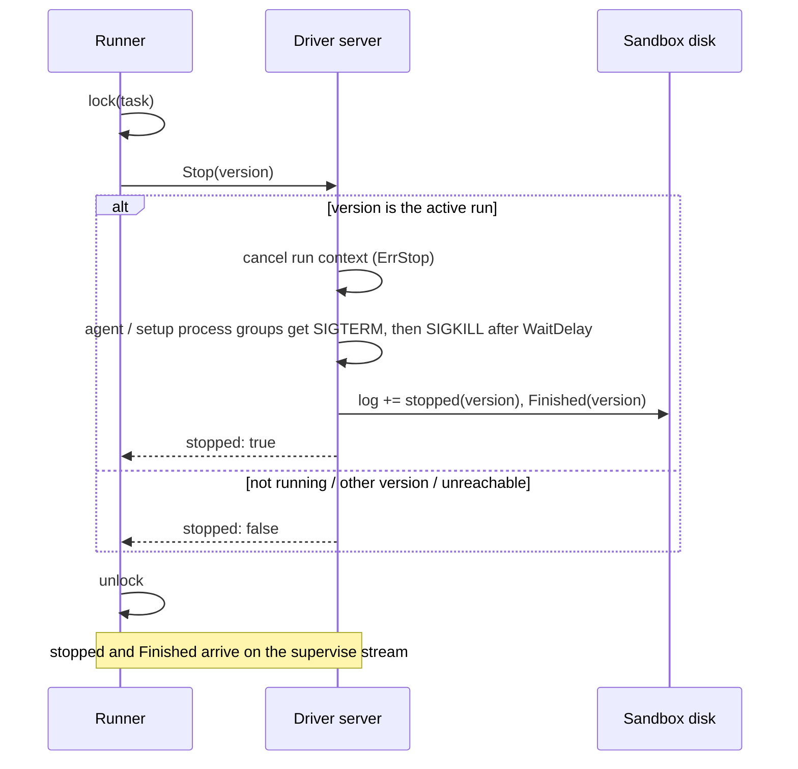
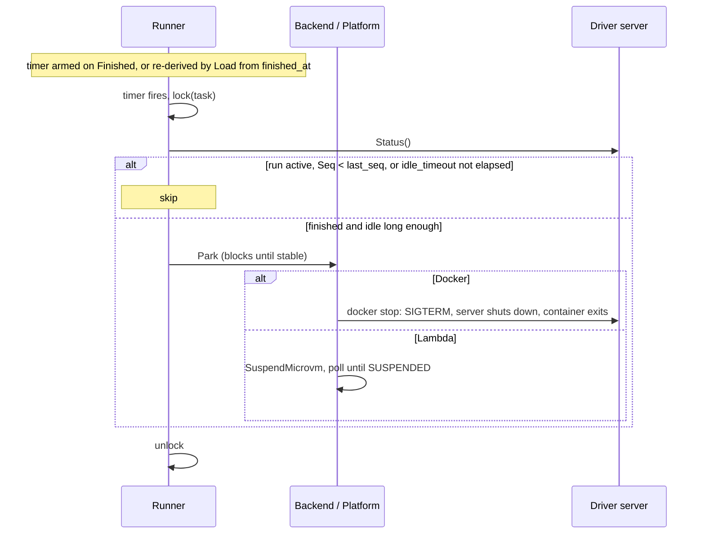

# Driver as a Server

Issue: https://github.com/icholy/gritz/issues/1646

## Problem

The runner has no common way to control the driver inside a sandbox. Docker runs
the driver as the container's main process and observes it through the container
lifecycle. Lambda MicroVMs need an in-VM supervisor (`internal/runner/microvmshim`,
`gritz tool microvm-shim`) that serves the AWS hooks, fetches a spec bundle staged
in S3, spawns the driver and reports its exit over a hand-rolled SSE stream. Every
proposed backend designs another variant: a generic standalone shim
(proposals/draft/generic-shim.md), a shim as the image `CMD` (DigitalOcean, #1588),
exec sessions (Fly Sprites, #1522), `systemd-run` units (exe.dev, #1108).

Problems that follow:

1. The driver assumes one run per process (flags, `driverSecrets()` reading its own
   environment, agent CLIs inheriting `os.Environ()`), so a sandbox that stays up
   between runs needs a supervisor to start a fresh driver per run.
2. `Probe`'s `StateRunning` means "sandbox running", but `Runner.Start`,
   `Runner.Load` and `Runner.Running` read it as "run active". On a backend whose
   sandbox stays up between runs, `Start` would never launch the next run.
3. `lambdamicrovm.Wait` fires `SuspendMicrovm` without waiting for it. A follow-up
   run that sees `SUSPENDING` gets `ErrGone`, which fails the task and drops the
   taskstate record; the VM is then never terminated.
4. Sandboxes are parked the moment a run ends; there is no warm period for quick
   follow-ups (#1196).
5. Lambda stages the bundle in S3 only because it travels through a 16 KB hook
   payload, even though the runner already reaches the VM over the managed proxy.
6. The driver talks to the server directly (`GetTask`, `ListEventsByTask`,
   `ListLinks`, `SubmitRunnerEvents`, `AppendLogChunk`), so every sandbox needs
   egress to the server, and the terminal report races the runner's own view of
   the run: `ExitCode` exists only to tell the runner whether the driver's report
   got through.
7. `Launch` returns a handle or an error, never both. A sandbox the platform
   created but that then failed to come up (a boot timeout, a failed binary copy,
   a cancelled context) is reported as an error alone; the runner has no record of
   it, and the sandbox leaks.

## Design

### Overview

The driver becomes a long-lived gRPC (Connect) server: `gritz driver --serve`.
It is the sandbox's main process on every backend, and it talks only to the
runner.

Key properties:

- **The runner is the driver's only peer.** The driver makes no calls to the
  server. Everything it used to fetch arrives in `Run`; everything it used to
  report (runner events, log chunks) goes back on the `Run` stream, and the runner
  delivers it.
- **The driver keeps a response log.** Every message it reports is appended to a
  durable log on the sandbox's disk with a sequence number. The runner owns its
  position in that log: `Run` takes the last sequence number the runner has made
  durable on its side, and replays everything after it, so a runner that crashes
  or loses its stream and reconnects gets everything it missed. The driver
  tracks no delivery state.
- **One `Backend` interface.** The backend manages sandboxes only; it never speaks
  the driver protocol beyond handing out a client. `Start` returns the handle
  alongside any error whenever a sandbox exists, and the runner persists a
  returned handle before looking at the error. The handle is recorded before the
  run starts, even when the sandbox fails to come up.
- **The runner owns the driver protocol.** `runner.go` calls `Status`, `Run` and
  `Stop`, consumes the stream and parks idle sandboxes.
- **Runs execute in-process**, one at a time. Everything per-process today becomes
  per-run.
- **`Run` is idempotent**, keyed on the task version. A run record on the
  sandbox's disk (`/gritz/run.json`) lets a restarted driver answer for a run it
  can no longer see.
- **There is no shim.** The AWS hook surface stays, but only as acknowledgements
  served by the driver on Lambda.

### Service definition

New module `proto/driver/v1/driver.proto`, generated into
`internal/proto/driver/v1` by the existing `buf.gen.yaml` (protocolbuffers/go +
connectrpc/go). It imports the `gritz.v1` messages it carries (`Task`, `Event`,
`TaskLink`, `RunnerEvent`) but is otherwise separate from `gritz.proto`, so it
evolves on its own cadence.

```protobuf
syntax = "proto3";

package driver.v1;

import "gritz/v1/gritz.proto";
import "google/protobuf/timestamp.proto";

option go_package = "github.com/icholy/gritz/internal/proto/driver/v1;driverv1";

// DriverService is served by `gritz driver --serve` inside the sandbox and
// called by the runner. Runs execute in-process, one at a time. The driver
// never calls the gritz server; it reports through its response log, which
// Run streams from the caller's position.
service DriverService {
  // Status reports that the server is up, plus the current run record and the
  // event cursor the runner fetches the next run's events from.
  rpc Status(StatusRequest) returns (StatusResponse);

  // Run is attach-or-start, keyed on version:
  //   another Run stream already open      -> Unavailable (retry)
  //   record.version > version             -> FailedPrecondition (stale)
  //   record.version == version            -> attach, spec ignored
  //   no record / older version, idle      -> start the run (spec required,
  //                                           NotFound without one)
  //   another version running              -> Aborted (busy)
  // At most one Run stream is open at a time. The stream first replays every
  // logged response with seq > after_seq, then follows new ones live. It ends
  // after the run's Finished has been sent. A dropped or closed stream detaches
  // and nothing else: the run keeps going, responses keep being logged, and the
  // next Run continues from whatever after_seq it brings.
  rpc Run(RunRequest) returns (stream RunResponse);

  // Stop gracefully stops the run with the given version: cancel the run
  // context with ErrStop (agents and setup commands SIGTERM their process
  // groups); the run's terminal event and Finished are logged as usual.
  // A no-op if that version is not the active run.
  rpc Stop(StopRequest) returns (StopResponse);
}

message RunRecord {
  enum State {
    STATE_UNSPECIFIED = 0;
    STATE_RUNNING = 1;
    STATE_FINISHED = 2;
  }
  int64 version = 1;
  State state = 2;
  // When the run finished. Drives the idle timeout.
  google.protobuf.Timestamp finished_at = 3;
}

message StatusRequest {}

message StatusResponse {
  // Absent if this sandbox has never started a run.
  optional RunRecord run = 1;
  // Sequence number of the last logged response. Zero if none.
  uint64 last_seq = 3;
  // ListEventsByTask page token after the last events delivered to the agent.
  // Empty before the first successful run.
  string event_token = 2;
}

// RunSpec carries everything the driver used to read from flags, its
// environment and the server.
message RunSpec {
  // The task as of this run: id, name, version, prompt, shell_session.
  gritz.v1.Task task = 1;
  // Instruction and external events after StatusResponse.event_token, fetched
  // by the runner.
  repeated gritz.v1.Event events = 2;
  // The page token after the last event above. Persisted by the driver once
  // the prompt is delivered.
  string event_token = 3;
  // The task's links. Only set on the first run.
  repeated gritz.v1.TaskLink links = 4;
  // Passed to setup commands and the agent CLI. Not set on the driver
  // process itself.
  map<string, string> env = 5;
  // Workspace secrets and the task token. Added to the run's env (except the
  // token) and masked in shipped log chunks.
  map<string, string> secrets = 6;
  // Agent config and directories. Provisioned once per sandbox, gated by
  // /gritz/.provisioned.
  repeated File files = 7;
}

message File {
  string path = 1;
  bytes data = 2;
  int64 mode = 3;
  bool dir = 4;
}

message RunRequest {
  int64 version = 1;
  // The last seq the runner has made durable on its side (taskstate's Seq).
  // Responses up to it are not replayed, and the driver may delete them.
  uint64 after_seq = 3;
  // Set to start a run. Omitted to attach.
  RunSpec spec = 2;
}

message RunResponse {
  // Response log sequence number. Set on runner_event, log_chunk and
  // finished, which are logged; zero on accepted and keep_alive, which are
  // per-stream and never stored.
  uint64 seq = 1;
  oneof event {
    // First message on every stream.
    Accepted accepted = 2;
    KeepAlive keep_alive = 3;
    // started / stopped / failed, stamped with the run's version.
    gritz.v1.RunnerEvent runner_event = 4;
    // A masked chunk of the run's log, cut at 32 KiB as today.
    LogChunk log_chunk = 5;
    // Last logged response of a run. Written after its terminal runner event.
    Finished finished = 6;
  }
}

message Accepted {
  // True if the call attached to an existing run rather than starting one.
  bool attached = 1;
}

message LogChunk {
  int64 version = 1;
  bytes data = 2;
}

message Finished {
  int64 version = 1;
}

message KeepAlive {}

message StopRequest {
  int64 version = 1;
}

message StopResponse {
  // True if a running run with this version was stopped.
  bool stopped = 1;
}
```

Everything from the runner to the driver is a unary call or the `Run` request
itself, and everything back is the `Run` stream, rather than a single
bidirectional stream, because Connect bidi needs HTTP/2 end to end and Lambda's
managed proxy is HTTP/1.1. Connect handlers serve the Connect, gRPC and
gRPC-Web protocols on a plain `net/http` server.

### The driver server

`gritz driver --serve [--addr :8080]` replaces `gritz driver` as the sandbox
entrypoint. It holds no task identity and no server credentials of its own;
everything arrives in `Run`.

**Per-run construction.** What `internal/command/driver.go` builds once per
process today moves into the `Run` handler, and the server calls go away:

| Today | Driver server |
|---|---|
| `--server` / `--task` / `--token` flags | `RunSpec.task`; no `gritzclient` |
| `GetTask` at the top of `Driver.Run` | `RunSpec.task` (the runner already holds it from its poll) |
| `drainEvents` (`ListEventsByTask` from `cfg.NextEventToken`) | `RunSpec.events`, fetched by the runner from `StatusResponse.event_token` |
| `ListLinks` on the first run | `RunSpec.links` |
| `SubmitRunnerEvents` for started / stopped / failed | logged `runner_event` responses |
| `logship.Shipper` calling `AppendLogChunk` | the shipper's sender logs `log_chunk` responses; masking and chunk cutting are unchanged |
| `driverSecrets()` reads `GRITZ_SECRETS` via `os.Getenv` | `RunSpec.secrets`; the `redact.Writer` is built per run before the first byte |
| `agent.OpenDriverLog` once | opened per run, still appending to `/gritz/log` |
| SIGTERM handler in `Driver.Run` | run context cancelled with `ErrStop` by `Stop`; SIGTERM to the server process means shut down (stopping an active run first) |
| exit code means "did the driver report?" | the response log: the terminal event is durable in the sandbox before `Finished` |

The event cursor stays in the driver's config (`cfg.NextEventToken`). The driver
saves `RunSpec.event_token` there after `a.Prompt` returns, as `drainEvents`'
result is saved today, and reports it in `Status`. The at-least-once delivery of
events to the agent is unchanged.

**Per-run environment.** Nothing may inherit the process environment, because
secrets arrive over RPC. `agent.Driver` gains an `Env []string` field, threaded
to:

- `agent/claude.go:72` and `agent/cursor.go:63` (`os.Environ()` today)
- `agent/codex.go`, `agent/copilot.go`, `agent/sloppy.go` (nil `cmd.Env` today,
  which inherits)
- setup commands, `agent/driver.go:288`
- `os.ExpandEnv(cfg.Cwd)`, `agent/driver.go:226`, which becomes `os.Expand` over
  the run env

**Response log.** `/gritz/responses/<version>.log`, one append-only file per
run of length-delimited `RunResponse` messages, each fsynced before it is
streamed. Responses are appended in the order the driver produces them, so a
run's log chunks and runner events interleave as they happened. Sequence numbers
are monotonic for the life of the sandbox, not per run, so a tail of an earlier
run that the runner has not yet stored is replayed before a new run's responses.
The driver deletes a version's file once a `Run` arrives with an `after_seq` at
or past that version's `Finished`; in practice, the previous run's file goes
when the next run starts.

**Run record.** `/gritz/run.json`, written atomically with
`internal/x/atomicio`:

- `{version, running}` before a run starts;
- `{version, finished, finished_at}` after the run's `Finished` is logged.

On boot, a record still `running` means the process died mid-run. Before
serving, the driver logs a `failed` runner event ("driver restarted mid-run")
and a `Finished` for that version, and rewrites the record as finished. The
runner learns about the crash through the log like any other outcome. The record
and the response log live on the sandbox's disk, so they survive driver
restarts and parking, but not sandbox loss.

**Server rules.**

- At most one run at a time. A `Run` that starts a new version while an older
  run has responses after `after_seq` is allowed; the stream replays them
  first.
- At most one `Run` stream at a time. A second `Run` while one is open is
  rejected with `Unavailable`, so there is only ever one reader of the log.
- A dropped stream is routine, not a failure. Proxies time out, tokens expire,
  runners restart. The run's context is independent of any request's context:
  the driver detaches the stream, keeps running the agent, keeps logging
  responses, and serves the next `Run` exactly as if it had stayed connected.
  Only `Stop` and the server's own shutdown cancel a run.
- The driver notices a dead stream when a write to it fails. `KeepAlive` is sent
  every 15 seconds, so a stream whose runner has gone away is released within
  that interval and the next `Run` is accepted.

**Authentication.** The driver takes an optional runner public key from
`GRITZ_RUNNER_PUBLIC_KEY` or `/gritz/runner.pub`, read on boot. The key is a
raw 32-byte Ed25519 public key encoded as unpadded base64url, 43 characters, so
it fits any channel a backend has. JWTs are signed with EdDSA.

- **Key present:** every request must carry `Authorization: Bearer <jwt>`,
  signed by the runner's key, with `sub` set to the task id and a short expiry.
  The driver verifies it against the key and rejects a `sub` other than the task
  of its first `Run`.
- **No key:** the API is unauthenticated.

Whether a sandbox needs the driver's own auth is the backend's decision, and
setting it up is part of `Start` creating the sandbox. A backend whose platform
authenticates the path to the sandbox per sandbox or per port (Lambda's
IAM-gated managed proxy, AgentCore) installs no key. A backend whose platform
does not, or only with an account-wide credential, writes the runner's public
key through a channel only it controls:

| Backend | Platform auth on the path | Key delivery |
|---|---|---|
| Lambda MicroVMs | IAM, per VM and port | none |
| AgentCore | IAM | none |
| Docker | none | env at create |
| DigitalOcean | none documented | env at create |
| Nomad | none without Consul mTLS | job env |
| Firecracker | none | MMDS or `config.tar` |
| Fly Sprites | the org-wide API token | fs API, right after create |
| exe.dev | SSH (port-forward) | SFTP |

The key is public, so an agent that reads it gains nothing. The runner keeps
one Ed25519 key pair in its state directory and puts the public half in every
`Spec` (`RunnerPublicKey`); the backend installs it or ignores it. The runner
signs a JWT and passes it to `Dial` regardless of backend: a driver with no key
ignores the header, so the runner never needs to know which kind of sandbox it
is talking to, and the backend never holds the signing key. The JWT's expiry
bounds the client's lifetime; the runner dials again when it expires or when a
call returns `Unauthenticated`. A `Run` stream is checked once, when it opens,
so a long run keeps its stream.

On every backend the agent inside the sandbox can reach the driver on
localhost without going through the platform's path, and with no key the
driver does not stop it. That is the same trust boundary as the agent's
existing ability to rewrite the response log or kill the driver.



### Backend interface

`Backend` and the earlier `Sandbox` split are merged into one interface. It
manages sandboxes; the runner speaks the driver protocol over the client `Dial`
returns.

```go
// Backend runs task sandboxes on a concrete runtime. It manages the sandbox
// itself and never speaks the driver protocol.
type Backend interface {
	ValidateWorkspace(ws *workspace.Workspace) error

	// Start ensures a running sandbox for spec and blocks until the platform
	// reports it running. With reuse == nil it creates one; otherwise it starts
	// or resumes the exact sandbox reuse identifies, and never creates a fresh
	// one. Starting a running sandbox is a no-op.
	//
	// The returned handle is non-nil whenever a sandbox exists, including
	// alongside an error: a sandbox that was created but failed to come up is
	// returned with the error so the runner can record it and destroy or retry
	// it later. A gone reuse sandbox returns (nil, ErrGone); a sandbox in a
	// transitional state (SUSPENDING, pausing) returns (reuse, error).
	Start(ctx context.Context, spec *Spec, reuse *Handle) (*Handle, error)

	// Dial returns a client for the sandbox's driver server. Every call it makes
	// carries jwt as a bearer token, plus any platform credentials (Lambda's
	// port-scoped proxy token). A driver with no runner key ignores the JWT.
	// Dial does not wait for the driver; readiness is the runner's Status
	// polling.
	Dial(ctx context.Context, h Handle, jwt string) (driverv1connect.DriverServiceClient, error)

	// Status reports the platform's view of the sandbox: Up, Parked or Gone.
	// Transitional states (SUSPENDING, pausing) report Parked.
	Status(ctx context.Context, h Handle) (Status, error)

	// Park stops compute while preserving the sandbox, blocking until the
	// platform reports the stable parked state.
	Park(ctx context.Context, h Handle) error

	// Destroy deletes the sandbox. Destroying an absent sandbox is not an error.
	Destroy(ctx context.Context, h Handle) error

	Close() error
}
```

`Start` is one call rather than separate create and start steps because not
every platform has both: Docker separates `ContainerCreate` from
`ContainerStart`, but most VM and sandbox APIs create and boot in a single call.
A backend whose platform does separate them returns the handle from the create
step alongside any error from the start step.

The runner's rule is the same for every call site: if `Start` returned a handle,
write it to `taskstate/` before handling the error.

```go
h, err := r.backend.Start(ctx, spec, reuse)
if h != nil {
	r.record(task, *h)
}
if err != nil {
	return err
}
```

`Spec` shrinks to what the platform needs to create the sandbox: `TaskID`,
`Workspace`, and `RunnerPublicKey`, which the backend installs in the sandbox
only if its platform does not authenticate the path (see Authentication). `Cmd`, `Env` and `Files` move into `RunSpec`. `Launch`, `Probe`,
`Signal`, `Wait` and `ExitCode` are removed.

### Runner

`runner.go` takes over what the backend used to hide. A per-task lock serializes
`Start`, `Kill`, `Remove` and the idle park.

| Runner method | With the driver server |
|---|---|
| `Start(task)` | Under the lock. `backend.Start(spec, reuse)` with the recorded handle, if any; write any returned handle to `taskstate/`, then return the error, if any. Then `Dial`, poll `Status` with backoff (timeout → error). A running record for this version: a no-op. Otherwise fetch events after `Status.event_token` (and links on the first run), mint the task token, `Run(version, spec, after_seq: record.Seq)` until `Accepted`, cancel any idle timer, and hand the stream to `supervise`. |
| `supervise` | Reads the stream. `runner_event` → enqueue on the runner event outbox; `log_chunk` → `AppendLogChunk`; then advance the record's `Seq` (batched). `Finished` for the task's current version → release the slot, arm the idle timer, return. A dropped stream is expected: re-dial and `Run(version, after_seq: Seq)` straight away, no recovery check, retrying `Unavailable` (the driver has not yet released the old stream) with backoff. Only when reconnecting keeps failing: `backend.Status`; gone → failed backstop and remove the record; parked → failed backstop; up → keep retrying until the readiness timeout (timeout → failed backstop). |
| `Load` | For each record: `backend.Status`; gone → as today; parked → `failIfTaskRunning`; up → `Dial`, `Run(version, after_seq: record.Seq)` to attach. The replay delivers whatever the previous runner process missed, including a `Finished` it never saw. |
| `Running` | `backend.Status` up and `Status` reports a running record for this version. |
| `Kill(task)` | Under the lock: `Stop(version)`; `signalled = stopped`. The terminal event arrives through the stream. |
| `Remove(task)` | Under the lock: cancel the idle timer, `Destroy`, remove the record. |
| `Prune` | Unchanged, on top of `backend.Status`. |

The failed backstop is now only for sandbox loss and an unreachable driver. A
driver crash is reported by the restarted driver through its response log, and a run
that finished while the runner was down is reported when the runner reattaches.

**Position.** The runner's position in a sandbox's response log is a `Seq` field
on its `taskstate/` record: the last sequence number that is durable on the
runner's side. A runner event is durable once `Enqueue` returns (the runner's
outbox delivers it to the server), a log chunk once `AppendLogChunk` succeeds.
Responses are processed in order, so a failed `AppendLogChunk` is retried with
backoff before later responses; a permanent failure drops the chunk and moves
on. `supervise` writes `Seq` in batches and after every runner event, under the
task's lock, rewriting the record it read so a concurrent `Start` and
`supervise` never lose each other's fields. A runner that crashes after
delivering a response but before writing `Seq` delivers it again on reattach.
The server's version guard already absorbs a repeated runner event. Repeated log
chunks are an open question. A record from before this change has no `Seq`,
which reads as 0: replay everything the driver still has.

**Event fetching.** The runner fetches the run's events with
`ListEventsByTask` from `Status.event_token`, filtered to the instruction and
external types, exactly as `drainEvents` does today, and the links with
`ListLinks` on the first run (`Status.event_token` empty and no run record).

### Idle parking

`Workspace` gains a backend-agnostic field:

```yaml
workspaces:
  pets-workshop:
    idle_timeout: 5m   # default 0: park as soon as the run finishes
```

When `supervise` sees `Finished`, the runner arms a timer for `idle_timeout`.
When it fires, it takes the task's lock and checks `Status`: it parks only if the
record is finished, `finished_at + idle_timeout` has passed, and the record's
`Seq` has reached `Status.last_seq`, so everything the driver logged is stored
on the runner's side. A `Start` that won the lock in between is never undone. With an
idle timeout of 0 this is today's behavior. `Load` re-derives timers from
`finished_at` for sandboxes that are up and idle.

The semaphore slot is released on `Finished`, not when the sandbox parks, so warm
sandboxes never block new runs. The idle timeout is the only bound on what warm
sandboxes cost.

If the runner restarts mid-park, the next `Start` may find the sandbox in a
transitional state. `backend.Start` returns a plain error: the run fails, the
taskstate record is kept, and a later start or archive proceeds normally.

### Platform implementations

| | Docker | Lambda MicroVMs |
|---|---|---|
| `Start`, fresh | `ContainerCreate` with `Cmd: [BinaryPath, "driver", "--serve"]`, `GRITZ_RUNNER_PUBLIC_KEY=spec.RunnerPublicKey` in `Env`, labels as today; tar-copy the prebuilt binary; `ContainerStart`. Any failure after `ContainerCreate` returns the handle with the error. | `RunMicrovm` with no run-hook payload, then poll until `RUNNING`. Any failure after `RunMicrovm` returns the handle with the error. |
| `Start`, reuse | `ContainerStart` | `RUNNING` → no-op; `SUSPENDED` → `ResumeMicrovm`, poll; `SUSPENDING` → plain error; terminal → `ErrGone` |
| `Dial` | client for `http://<container IP>:8080` on its network, adding the JWT | client for the managed proxy endpoint, adding a minted port-scoped token and the JWT |
| `Status` | inspect: running → Up, exited → Parked, not found → Gone | `GetMicrovm` |
| `Park` | `docker stop` with an explicit timeout covering a graceful server shutdown | `SuspendMicrovm`, then poll until `SUSPENDED` |
| `Destroy` | `ContainerRemove` (force) | `TerminateMicrovm` |

Lambda changes:

- The image entrypoint (`internal/runner/backend/lambdamicrovm/microvm.Dockerfile`)
  becomes `gritz driver --serve --aws-lambda-hooks`. The flag mounts
  `awsmicrovm.Handler` with nil funcs on `awsmicrovm.HookPort`, which acknowledges
  every hook with 200. No hook does work.
- The run spec travels in `Run` over the proxy, so the `Stager` interface,
  `awsmvm.S3Stager`, `LambdaMicroVM.StagingBucket` and the S3 permission on the
  execution role are removed.
- `internal/runner/microvmshim` and `gritz tool microvm-shim` are deleted.

### Sequences

Start:



Supervise:



Runner crash and reattach:

```mermaid
sequenceDiagram
    participant R as Runner (new process)
    participant T as taskstate/
    participant P as Backend / Platform
    participant D as Driver server
    participant F as Sandbox disk

    Note over D,F: run continued; responses logged past the runner's Seq
    R->>T: list records {version, handle, Seq: n}
    R->>P: Status(handle)
    P-->>R: Up
    R->>P: Dial(handle)
    R->>D: Run(version, after_seq: n)
    D->>F: read log after n
    D-->>R: Accepted{attached: true}
    D-->>R: RunResponse{seq: n+1}, RunResponse{seq: n+2}, ...
    Note over R,D: then live responses, as in Supervise
```

Kill:



Idle park:



### What doesn't change

The runner event outbox, the server, the database schema, the task state
machine, and `gritz.proto`. The taskstate store gains only the `Seq` field. The terminal event's meaning is
unchanged: the driver decides `started`, `stopped` and `failed`, and the server's
version guard drops a stale one. Only the path changes, from driver → server to
driver response log → runner outbox → server.

## Implementation Plan

The design lands in phases. Every step merges on its own and leaves a working
system; the new path stays opt-in until it has replaced the old one.

### Phase A: the driver server behind an experimental Docker backend

The first pass changes the driver's process model and nothing else. The driver
server still talks to the gritz server directly, exactly as the one-shot driver
does, so today's `backend.Backend` interface (`Launch`, `Wait`, `Probe`,
`Signal`, `Destroy`) keeps its meaning: `Wait` still answers "did the driver
report?". Only Docker, no Lambda, no idle parking, no runner key.

1. **Per-run environment** — Delivers: `agent.Driver.Env`, threaded to every agent
   CLI, setup commands and `Cwd` expansion; `gritz driver` sets it to
   `os.Environ()`, so behavior is unchanged. Depends on: nothing. Verifiable by:
   agent unit tests asserting the child env.
2. **`driver.v1` proto, first cut** — Delivers: `proto/driver/v1/driver.proto`
   with `Status`, `Run` and `Stop`. `RunSpec` carries what the driver reads from
   flags and its environment today (`task_id`, `server_url`, `token`, `env`,
   `secrets`); `RunResponse` carries `accepted`, `keep_alive` and `finished`,
   whose `Finished` gains a `reported` bool for this phase. Depends on: nothing.
   Verifiable by: `mise run generate` produces a compiling package.
3. **Run record** — Delivers: a package reading/writing `/gritz/run.json`
   atomically, with boot reconciliation (`running` → `finished, reported:
   false`). Depends on: nothing. Verifiable by: unit tests in a temp dir.
4. **Driver server, reporting directly** — Delivers: `gritz driver --serve`. Each
   `Run` builds its own gritz client, log shipper and secret mask from the
   `RunSpec`; `Run` is attach-or-start keyed on version; one `Run` stream at a
   time; a dropped stream leaves the run going; `Stop` cancels the run with
   `ErrStop`; SIGTERM stops an active run and shuts down. The driver reports
   `started`, `stopped` and `failed` to the server itself, and `Finished` says
   whether that report was acknowledged. `gritz driver` (one-shot) stays.
   Depends on: (1), (2), (3). Verifiable by: in-memory Connect client tests with
   a dummy agent and a fake gritz server: start, attach, idempotent re-`Run`,
   reconnect after a dropped stream, a second concurrent `Run`,
   stale/busy/not-found, `Stop`, restart reconciliation.
5. **`ExperimentalDocker` backend** — Delivers: a second Docker implementation of
   today's `backend.Backend`, with its own handle `Type`
   (`experimental-docker`), and `backend.Spec.Version`, set by `Runner.spec()`
   from `task.Version` (the only change to `runner.go`). Depends on: (4).
   Verifiable by: the existing Docker e2e suite run against it.

   | Method | Behavior |
   |---|---|
   | `Launch` | Create the container with `Cmd: [BinaryPath, "driver", "--serve"]`, copy the binary and `spec.Files` as today, `ContainerStart` (fresh or reuse), dial the container's IP on :8080, poll `Status` until it answers, then `Run(version, spec)` until `Accepted`. |
   | `Wait` | `Run(version)` with no spec, read until `Finished`. On a dropped stream: container gone or exited → `ExitLost`; running → reconnect. On `Finished`, `docker stop` the container, so between runs it is stopped exactly as today, then return 0 if `reported`, else `ExitLost`. |
   | `Probe` | Container gone → `StateGone`; not running → `StateExited`; running → `Status`: this version running → `StateRunning`, otherwise `StateExited`. |
   | `Signal` | `Stop(version)`; `signalled = stopped`. |
   | `Destroy` | `ContainerRemove` (force). |

6. **Opt-in** — Delivers: a runner flag that selects `ExperimentalDocker` instead
   of `Docker`. A handle of any other `Type` is rejected with `ErrGone`, so the
   flag is meant for a runner with no active Docker tasks. Depends on: (5).
   Verifiable by: running a runner with the flag against a dev server.

Phase A leaves open: the runner must reach the container's IP (open question 3);
sibling containers on a shared bridge can reach `:8080` until phase C adds the
runner key; and a container created before an upgrade keeps its old driver
binary, so `driver.v1` changes in later phases must stay wire-compatible, or
experimental containers be recreated.

### Phase B: the runner forwards everything

7. **Driver inputs and outputs behind interfaces** — Delivers: `agent.Driver`
   takes the task, events and links as inputs and reports runner events and log
   chunks through a sink. The one-shot driver and the phase A server implement
   both with `gritzclient`, so behavior is unchanged. Depends on: (4).
8. **Response log** — Delivers: the per-version `RunResponse` log with
   read-after-seq and deletion behind a position; `RunRequest.after_seq`,
   `StatusResponse.last_seq`, and the `runner_event` and `log_chunk` cases.
   Depends on: (2).
9. **Merged `Backend` interface and runner path** — Delivers: the interface from
   the design (`Start`, `Dial`, `Status`, `Park`, `Destroy`), a second path in
   `runner.go` for backends that implement it (`Start`, `supervise` forwarding and
   advancing `Seq`, `Load`, `Kill`, `Remove`), `taskstate.Record.Seq`, and
   `ExperimentalDocker` moved onto it with the driver server reporting through the
   response log. The old path is untouched. Depends on: (7), (8). Verifiable by:
   runner tests against a fake backend and an in-memory driver server, including
   a runner restart mid-run; the Docker e2e suite against `ExperimentalDocker`.

### Phase C: auth and idle parking

10. **Runner key** — Delivers: the runner's key pair, `Spec.RunnerPublicKey`,
    `Dial(jwt)`, and JWT verification in the driver when it has a key.
    `ExperimentalDocker` installs the key. Depends on: (9).
11. **Idle parking** — Delivers: `Workspace.IdleTimeout` (default 0, today's
    behavior), the runner's idle timers and `Park`. `ExperimentalDocker` parks
    with `docker stop` instead of stopping after every run. Depends on: (9).

### Phase D: Lambda

12. **Lambda transitional-state fix** — Delivers: `tryResume` returns a plain
    error for `SUSPENDING` (keeping `ErrGone` for `TERMINATING`/`TERMINATED`),
    and `Wait` polls until `SUSPENDED` after `SuspendMicrovm`. Depends on:
    nothing; can land at any time. Verifiable by: `lambdamicrovm` unit tests
    against the fake `Cloud`.
13. **Lambda on the new interface** — Delivers: the Lambda implementation, the
    `gritz driver --serve --aws-lambda-hooks` image entrypoint, README update, as
    an opt-in backend type. Depends on: (9), (11). Verifiable by: an image built
    per the README running a task end to end, including suspend/resume.

### Phase E: switch over and remove the old path

14. **New backends by default** — Delivers: the new Docker and Lambda backends as
    the defaults. Existing records are dispatched by `Handle.Type`, so old
    sandboxes stay on the old path until their tasks are archived (open
    question 4). Depends on: (10), (11), (13).
15. **Remove the old path** — Delivers: deletion of `Launch`, `Wait`, `Probe`,
    `Signal`, `ExitCode`, the old Docker and Lambda backends, the one-shot
    `gritz driver`, `internal/runner/microvmshim`, `gritz tool microvm-shim`, the
    `Stager`, `awsmvm.S3Stager` and `LambdaMicroVM.StagingBucket`. Depends on:
    (14), once no old records remain. Verifiable by: build and tests.

## Trade-offs

**Driver as server vs. a shim.** A shim (today's `microvmshim`, or the generic
shim proposal) keeps the driver one-shot and isolates each run in its own
process, which gives a fresh environment, a real exit code and crash containment
for free. The cost is a second in-sandbox component, a supervisor contract, and
for the generic shim a second release artifact. Making the driver the server
removes all of that; the price is the per-run refactor of the driver and a
weaker failure mode, below.

**In-process runs vs. a child process per run.** A server that spawns
`gritz driver run` per `Run` would keep today's driver unchanged, but it is the
shim's supervisor role folded into the gritz binary rather than removed. In-process
runs mean a panic in one run kills the server: the restarted driver reports the
run as failed from its run record, but the real exit code is gone.

**Driver reports through the runner vs. directly to the server.** Routing
everything through the runner means the sandbox needs no route to the server for
the driver's own traffic, the runner sees every outcome first-hand (no exit-code
signalling, no race between the driver's report and the runner's backstop), and
the server's inputs come from one component. The cost is that the runner is now
on the path of every log byte, and a runner that is down delays (but does not
lose) the driver's reports until it reattaches.

**Runner-held position vs. driver-held acks.** With an outbox and an `Ack` RPC
the driver would track delivery, and the runner would persist nothing per
message. With the position in `taskstate/`, the driver keeps no state about its
reader, there is one RPC fewer, every reconnect is the same `Run(version,
after_seq)`, and the log is an exact history of the run that any reader can
replay. The cost is a `taskstate/` write per batch, the coordination between
`Start` and `supervise` on the record, and at-least-once delivery for whatever
was delivered after the last `Seq` write when the runner crashes.

**Runner owns the driver protocol vs. a `DriverBackend` adapter.** An adapter
would keep `runner.go` unchanged behind the old `Launch`/`Wait`/`Probe`
interface, but `Launch` could only return the handle after the run started, and
the log replay would be hidden behind `Wait`. With one sandbox-only `Backend`,
the handle is persisted as soon as `Start` returns, before the run starts, and
the runner deals with runs directly. The cost is a larger change to `runner.go` and its tests.

**Idle timer in the runner vs. the driver or the platform.** The driver knows
idleness exactly but holds no platform credentials, and on Lambda or DigitalOcean
a process exit does not park. Platform idle policies (Lambda `idlePolicy`,
DigitalOcean `auto_pause`) judge idleness by activity, not by "no active run", so
a quiet agent could be parked mid-run; Lambda's minimum is also 600s. The runner
has both the knowledge (`Status`) and the credentials (via the backend).

**One `Start` returning a handle with its error vs. separate `Create` and
`Start`.** A separate `Create` would let the runner persist the handle before
the sandbox boots, closing the window in which a runner crash mid-boot leaks the
sandbox. But many platforms create and boot in one blocking call, so `Create`
could not be implemented as specified there. Returning the handle alongside the
error covers every failure the backend can observe on all platforms; only a
runner crash during `Start` is left uncovered, which is open question 10.

**Server streaming plus unary calls vs. bidirectional streaming.** A bidi `Run`
would carry `Stop` and the runner's position on the same stream, but needs
HTTP/2 end to end, which Lambda's managed proxy does not provide.

**Connect vs. grpc-go.** Connect handlers are plain `net/http`, already used
throughout the codebase, and speak gRPC as well as protocols that pass HTTP/1.1
proxies. grpc-go requires HTTP/2 end to end.

## Open Questions

1. **Agent MCP and shell relay.** The injected `gritz tool agent-mcp` server and
   the debug-shell relay (`shell.Serve`) still dial the server with the task
   token. Are they in scope? The MCP tools are request/response, which the `Run`
   stream cannot carry; they would need their own RPC on the driver that the
   runner proxies, or keep going direct.
2. **Duplicate log chunks.** A chunk delivered after the last `Seq` write
   before a runner crash is appended twice. Should `AppendLogChunkRequest` gain a sequence
   number the server deduplicates on, or is a rare repeated chunk acceptable?
3. **Docker reachability.** The runner dials the container's IP. That works when
   the runner is on the host or shares a network with the container. Is that
   always true for existing deployments, or does Docker need a published port or
   a bind-mounted unix socket instead?
4. **Migrating existing sandboxes.** Containers and MicroVMs created before
   steps 8/9 run the one-shot driver. Should the runner detect old handles (by
   `Handle.Type` or a container label) and keep the old path until those tasks
   are archived, or fail them with a clear error?
5. **Driver revalidation.** A sandbox that stays up across a gritz release keeps
   serving with the old driver. Should `Status` report the driver version so the
   runner can park and restart stale drivers between runs?
6. **Lambda process exit.** What does Lambda do when the main process of a running
   MicroVM exits (a driver crash)? If the VM stays `RUNNING`, the health timeout
   covers it, but `Start` has no way to restart the process; should the runner
   destroy it and treat it as gone?
7. **Response log size.** A version's log is only deleted when the next run
   starts, so a long run, or a runner that stays down, leaves it growing with
   log chunks. Should the driver cap it (dropping the oldest log
   chunks, never runner events)?
8. **Status timeout values.** How long should `Start` and `supervise` wait for a
   ready driver before failing? Docker boots in seconds; a fresh Lambda VM may
   take longer.
9. **Idle-timeout limits.** Should the runner cap `idle_timeout` (warm sandboxes
   hold host memory or account quota outside the concurrency semaphore), and
   should warm sandboxes count toward any limit?
10. **Runner crash during `Start`.** A runner that dies while `Start` is
    blocking never receives the handle, so a sandbox the platform created is not
    recorded. Should `Prune` find such sandboxes by the gritz labels or tags the
    backend sets on create and destroy those with no taskstate record?
11. **Runner key rotation.** Sandboxes hold the public key they were created
    with. Should a runner that rotates its key re-deliver the new one through
    the backend's channel, or keep old keys around until those sandboxes are
    destroyed?
12. **Half-open streams.** The driver releases a stream only when a write to it
    fails. A proxy that accepts writes for a client that is already gone would
    keep the old stream "open" and make every new `Run` return `Unavailable`.
    Should streams also have a maximum lifetime, or should a new `Run` from the
    same runner replace the old stream instead of being rejected?
