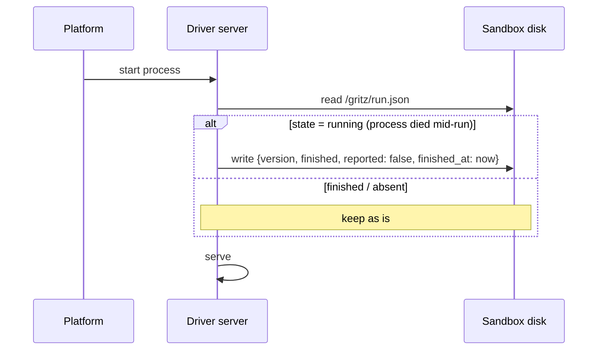
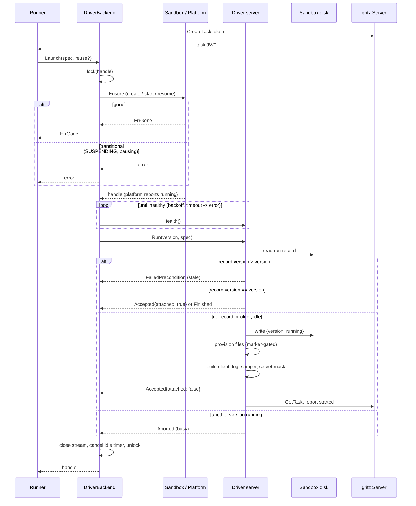
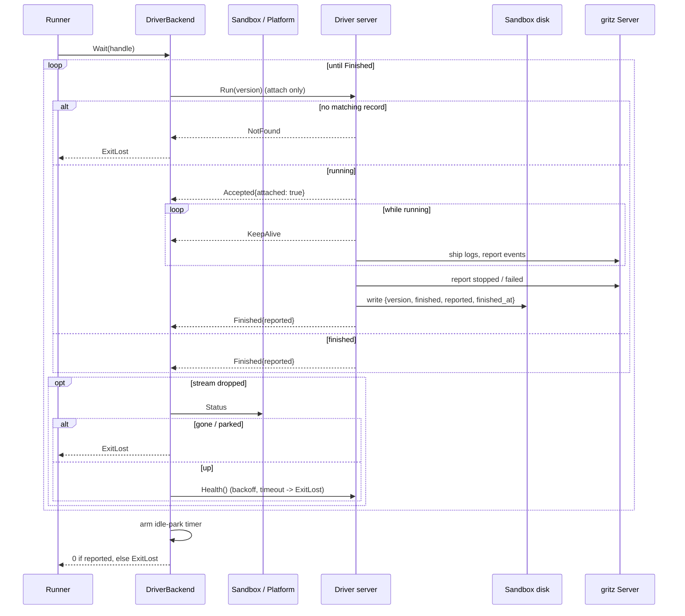
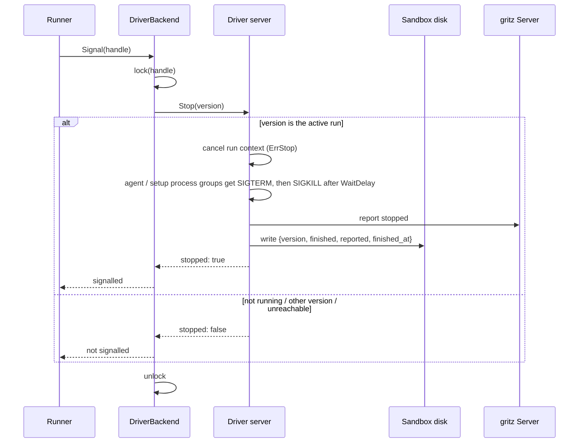
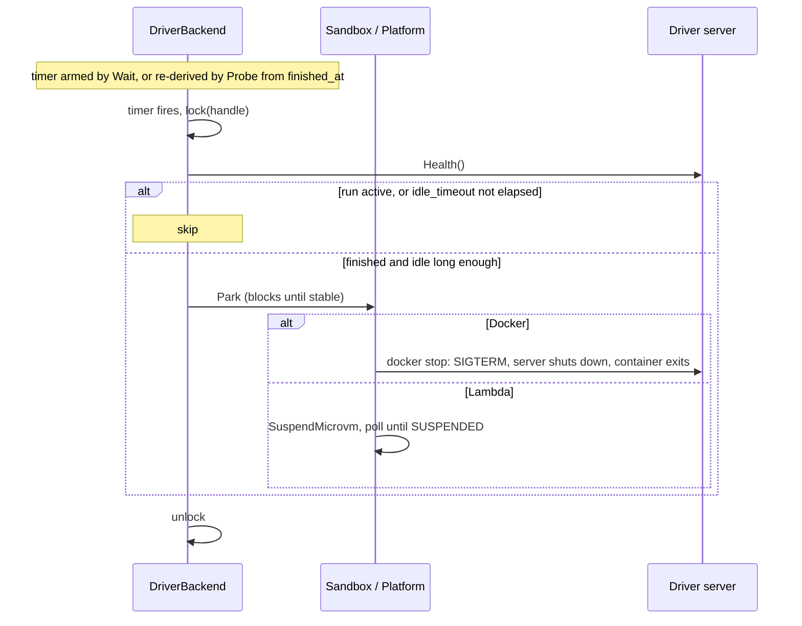
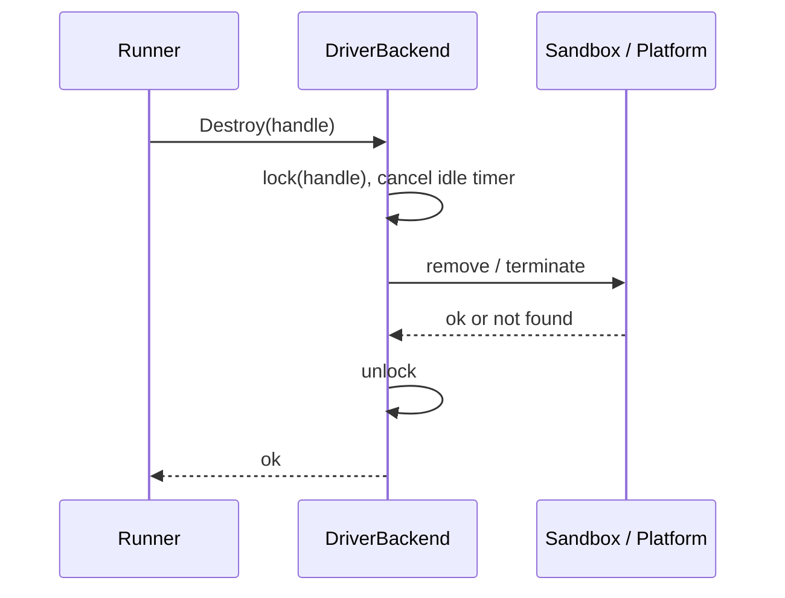

# Driver as a Server

Issue: https://github.com/icholy/gritz/issues/1646

## Problem

The runner has no common way to control the driver inside a sandbox. Docker runs
the driver as the container's main process and observes it through the container
lifecycle. Lambda MicroVMs need an in-VM supervisor (`internal/runner/microvmshim`,
`gritz tool microvm-shim`) that serves the AWS hooks, fetches a spec bundle staged
in S3, spawns the driver and reports its exit over a hand-rolled SSE stream. Every
proposed backend designs another variant: a generic standalone shim
(proposals/draft/generic-shim.md), a shim as the image `CMD` (DigitalOcean, #1588),
exec sessions (Fly Sprites, #1522), `systemd-run` units (exe.dev, #1108).

Problems that follow:

1. The driver assumes one run per process (flags, `driverSecrets()` reading its own
   environment, agent CLIs inheriting `os.Environ()`), so a sandbox that stays up
   between runs needs a supervisor to start a fresh driver per run.
2. `Probe`'s `StateRunning` means "sandbox running", but `Runner.Start`,
   `Runner.Load` and `Runner.Running` read it as "run active". On a backend whose
   sandbox stays up between runs, `Start` would never launch the next run.
3. `lambdamicrovm.Wait` fires `SuspendMicrovm` without waiting for it. A follow-up
   run that sees `SUSPENDING` gets `ErrGone`, which fails the task and drops the
   taskstate record; the VM is then never terminated.
4. Sandboxes are parked the moment a run ends; there is no warm period for quick
   follow-ups (#1196).
5. Lambda stages the bundle in S3 only because it travels through a 16 KB hook
   payload, even though the runner already reaches the VM over the managed proxy.

## Design

### Overview

The driver becomes a long-lived gRPC (Connect) server: `gritz driver --serve`.
It is the sandbox's main process on every backend. The runner never talks to it
directly; a single backend-layer type, `DriverBackend`, speaks the driver protocol
and implements the existing `backend.Backend` interface on top of a smaller
per-platform `Sandbox` interface. `runner.go` is unchanged.

Key properties:

- **Runs execute in-process**, one at a time. Everything per-process today becomes
  per-run.
- **`Run` is idempotent**, keyed on the task version. A run record on the
  sandbox's disk (`/gritz/run.json`) lets a restarted driver answer for a run it
  can no longer see.
- **Parking is a backend detail**, driven by a per-workspace idle timeout. `Park`
  blocks until the platform reaches its parked state, and a per-sandbox lock
  serializes it against `Launch`, `Signal` and `Destroy`.
- **There is no shim.** The AWS hook surface stays, but only as acknowledgements
  served by the driver on Lambda.

### Service definition

New module `proto/driver/v1/driver.proto`, generated into
`internal/proto/driver/v1` by the existing `buf.gen.yaml` (protocolbuffers/go +
connectrpc/go). It is separate from `gritz.proto` so the driver links only its own
messages and evolves on its own cadence.

```protobuf
syntax = "proto3";

package driver.v1;

import "google/protobuf/timestamp.proto";

option go_package = "github.com/icholy/gritz/internal/proto/driver/v1;driverv1";

// DriverService is served by `gritz driver --serve` inside the sandbox and
// called by the backend. Runs execute in-process, one at a time. The run
// record (/gritz/run.json) makes Run and Stop idempotent across driver
// restarts.
service DriverService {
  // Health reports that the server is up, plus the current run record.
  // DriverBackend polls it from Launch and Wait.
  rpc Health(HealthRequest) returns (HealthResponse);

  // Run is attach-or-start, keyed on version:
  //   record.version > version             -> FailedPrecondition (stale)
  //   record.version == version, finished -> Finished, stream ends
  //   record.version == version, running  -> attach, spec ignored
  //   no record / older version, idle      -> start the run (spec required,
  //                                           NotFound without one)
  //   another version running              -> Aborted (busy)
  // The stream stays open until the run finishes. Closing it detaches; it
  // does not cancel the run.
  rpc Run(RunRequest) returns (stream RunResponse);

  // Stop gracefully stops the run with the given version: cancel the run
  // context with ErrStop (agents and setup commands SIGTERM their process
  // groups), report stopped, finish the record. A no-op if that version is
  // not the active run.
  rpc Stop(StopRequest) returns (StopResponse);
}

message RunRecord {
  enum State {
    STATE_UNSPECIFIED = 0;
    STATE_RUNNING = 1;
    STATE_FINISHED = 2;
  }
  int64 version = 1;
  State state = 2;
  // Whether the driver's terminal report was acknowledged by the server.
  // Only meaningful when state is FINISHED.
  bool reported = 3;
  // When the run finished. Drives the idle timeout.
  google.protobuf.Timestamp finished_at = 4;
}

message HealthRequest {}

message HealthResponse {
  // Absent if this sandbox has never started a run.
  optional RunRecord run = 1;
}

// RunSpec replaces the driver's flags and inherited environment, so a
// long-lived driver gets fresh values per run.
message RunSpec {
  int64 task_id = 1;
  string server_url = 2;
  // Task JWT, minted by the runner before Launch.
  string token = 3;
  // Passed to setup commands and the agent CLI. Not set on the driver
  // process itself.
  map<string, string> env = 4;
  // Workspace secrets. Added to the run's env and masked in the shipped log.
  map<string, string> secrets = 5;
  // Provisioned once per sandbox, gated by /gritz/.provisioned.
  repeated File files = 6;
}

message File {
  string path = 1;
  bytes data = 2;
  int64 mode = 3;
  bool dir = 4;
}

message RunRequest {
  int64 version = 1;
  // Set by Launch to start a run. Omitted by Wait, which only attaches.
  RunSpec spec = 2;
}

message RunResponse {
  oneof event {
    // First message on every stream that attaches or starts.
    Accepted accepted = 1;
    KeepAlive keep_alive = 2;
    // Last message on every stream.
    Finished finished = 3;
  }
}

message Accepted {
  // True if the call attached to an existing run rather than starting one.
  bool attached = 1;
}

message KeepAlive {}

message Finished {
  // False means the run ended without its terminal report reaching the
  // server (including a driver that died mid-run). Wait returns ExitLost
  // and the runner reports failed on its behalf.
  bool reported = 1;
}

message StopRequest {
  int64 version = 1;
}

message StopResponse {
  // True if a running run with this version was stopped.
  bool stopped = 1;
}
```

Connect handlers serve the Connect, gRPC and gRPC-Web protocols on a plain
`net/http` server, so the protocol works over HTTP/1.1 proxies (Lambda's managed
proxy) as well as HTTP/2.

### The driver server

`gritz driver --serve [--addr :8080]` replaces `gritz driver` as the sandbox
entrypoint. It holds no task identity of its own; everything arrives in `Run`.

**Per-run construction.** `agent.Driver` already takes its dependencies as
fields (`Client`, `Log`, `Token`, `ServerURL`). What `internal/command/driver.go`
builds once per process today moves into the `Run` handler:

| Today (per process) | Driver server (per `Run`) |
|---|---|
| `--server` / `--task` / `--token` flags | `RunSpec` fields; `gritzclient` built per run |
| `driverSecrets()` reads `GRITZ_SECRETS` and values via `os.Getenv` | `RunSpec.secrets`; `logship.Shipper` and its `redact.Writer` built per run before the first shipped byte |
| `agent.OpenDriverLog` once | opened per run, still appending to `/gritz/log` |
| SIGTERM handler in `Driver.Run` (`agent/driver.go:53`) | run context cancelled with `ErrStop` by the `Stop` RPC; SIGTERM to the server process means shut down (stopping an active run first) |
| exit code means "did the driver report?" | `Finished{reported}` plus the run record |

**Per-run environment.** Nothing may inherit the process environment, because
the task token and secrets arrive over RPC. `agent.Driver` gains an `Env []string`
field, threaded to:

- `agent/claude.go:72` and `agent/cursor.go:63` (`os.Environ()` today)
- `agent/codex.go`, `agent/copilot.go`, `agent/sloppy.go` (nil `cmd.Env` today,
  which inherits)
- setup commands, `agent/driver.go:288`
- `os.ExpandEnv(cfg.Cwd)`, `agent/driver.go:226`, which becomes `os.Expand` over
  the run env

**Run record.** `/gritz/run.json`, written atomically with
`internal/x/atomicio`:

- `{version, running}` before a run starts;
- `{version, finished, reported, finished_at}` after the terminal report is
  acknowledged (or fails).

On boot, a record still `running` means the process died mid-run; the server
rewrites it as `finished, reported: false` before serving. The record lives on
the sandbox's disk, so it survives driver restarts and parking, but not sandbox
loss (which is `ErrGone` anyway).

**Server rules.** At most one run at a time. A `Finished` result is never
lost: it comes from the run record, so a stream that reconnects after the run
ends (or after a driver restart) still gets it.

**Authentication.** The server requires `Authorization: Bearer <token>` with a
constant-time compare against `GRITZ_DRIVER_TOKEN` from its environment. The
backend generates 32 random bytes per sandbox at creation and stores them in
`Handle.Data`. Lambda cannot inject a per-sandbox value into a snapshot, so on
Lambda the variable is unset and the server relies on the managed proxy's
port-scoped auth tokens, as the shim does today.



### Backend layer: `Sandbox` and `DriverBackend`

The per-platform work shrinks to a `Sandbox` interface:

```go
// Sandbox is the platform-specific half of a backend. It manages the sandbox
// itself; it never speaks the driver protocol.
type Sandbox interface {
	ValidateWorkspace(ws *workspace.Workspace) error
	// Ensure creates (reuse == nil) or starts/resumes (reuse != nil) the sandbox
	// and blocks until the platform reports it running. A gone reuse sandbox
	// returns backend.ErrGone; a sandbox in a transitional state (SUSPENDING,
	// pausing) returns a plain error.
	Ensure(ctx context.Context, spec *Spec, reuse *Handle) (Handle, error)
	// Dial returns an authenticated client for the sandbox's driver server.
	Dial(ctx context.Context, h Handle) (driverv1connect.DriverServiceClient, error)
	// Status reports the platform's view of the sandbox: Up, Parked or Gone.
	// Transitional states (SUSPENDING, pausing) report Parked.
	Status(ctx context.Context, h Handle) (SandboxStatus, error)
	// Park stops compute while preserving the sandbox, blocking until the
	// platform reports the stable parked state.
	Park(ctx context.Context, h Handle) error
	Destroy(ctx context.Context, h Handle) error
	Close() error
}
```

`DriverBackend` implements `backend.Backend` once, for every platform:

```go
type DriverBackend struct {
	sandbox Sandbox
	locks   keyedMutex // per Handle.ID; serializes Launch, Park, Signal, Destroy
	timers  ...        // idle-park timers
}
```

It wraps the sandbox's `Handle.Data` with the run version, so the existing
`Wait(ctx, h)` and `Signal(ctx, h)` signatures carry it without changes to the
interface or `runner.go`. `backend.Spec` gains a `Version int64` field, set by
`Runner.spec()` from `task.Version`.

| `backend.Backend` method | `DriverBackend` implementation |
|---|---|
| `Launch(spec, reuse)` | Under the lock: `Sandbox.Ensure`; poll `Health` with backoff (on timeout with the sandbox up, return an error); `Run(version, spec)` until `Accepted` or `Finished`; close the stream; cancel any pending idle-park timer. |
| `Wait(h)` | Not under the lock. `Run(version)` without a spec, read until `Finished`. On a stream drop, `Sandbox.Status`: gone or parked → `ExitLost`; up → re-dial and `Health` with backoff (timeout → `ExitLost`), then attach again. On `Finished`, schedule the idle park and return `0` if `reported`, else `ExitLost`. Context cancellation returns `ctx.Err()` as today. |
| `Signal(h)` | Under the lock: `Stop(version)`; `signalled = stopped`. An unreachable driver is `false`. |
| `Probe(h)` | `Sandbox.Status`: gone → `StateGone`; parked → `StateExited`; up → `Health`: a running record for this handle's version (or an unreachable driver) → `StateRunning`, otherwise `StateExited`. When it observes a finished, unparked sandbox it schedules the idle park from `finished_at`, which re-derives timers after a runner restart. |
| `Destroy(h)` | Under the lock: cancel the timer, `Sandbox.Destroy`. |
| `Close()` | Stop timers (pending parks are re-derived on the next boot), `Sandbox.Close`. |

`Probe` now answers the orchestrator's real question, so `Start`, `Load`,
`Running`, `List` and `Prune` behave correctly on sandboxes that stay up between
runs. An unreachable driver on an up sandbox reports `StateRunning` so `Load`
attaches `Wait`, whose health timeout converges it to `ExitLost`.

### Idle parking

`Workspace` gains a backend-agnostic field:

```yaml
workspaces:
  pets-workshop:
    idle_timeout: 5m   # default 0: park as soon as the run finishes
```

When `Wait` returns, `DriverBackend` arms a timer for `idle_timeout`. When it
fires, `Park` runs under the lock and checks `Health` again: it parks only if the
record is finished and `finished_at + idle_timeout` has passed, so a `Launch`
that won the lock in between is never undone. With an idle timeout of 0 this is
today's behavior.

The semaphore slot is released when `Wait` returns, not when the sandbox parks,
so warm sandboxes never block new runs (the problem #1196 identified with a
blocking `Wait`). The idle timeout is the only bound on what warm sandboxes cost.

If the runner restarts mid-park, the next `Launch` may find the sandbox in a
transitional state. `Ensure` returns a plain error: the run fails, the taskstate
record is kept, and a later start or archive proceeds normally. This is accepted
rather than handled.

### Platform implementations

| | Docker | Lambda MicroVMs |
|---|---|---|
| `Ensure`, fresh | `ContainerCreate` with `Cmd: [BinaryPath, "driver", "--serve"]`, `GRITZ_DRIVER_TOKEN` in `Env`, labels as today; tar-copy the prebuilt binary (as today, `spec.Files` now travel in `Run`); `ContainerStart` | `RunMicrovm` with no run-hook payload; poll until `RUNNING` |
| `Ensure`, reuse | `adopt` + `ContainerStart` | `SUSPENDED` → `ResumeMicrovm`; `RUNNING` → adopt; `SUSPENDING` → plain error; terminal → `ErrGone` |
| `Dial` | container IP on its network, port 8080, bearer from `Handle.Data` | managed proxy endpoint, minted port-scoped token |
| `Park` | `docker stop` with an explicit timeout covering a graceful server shutdown | `SuspendMicrovm`, then poll until `SUSPENDED` |
| `Destroy` | `ContainerRemove` (force) | `TerminateMicrovm` |

Lambda changes:

- The image entrypoint (`internal/runner/backend/lambdamicrovm/microvm.Dockerfile`)
  becomes `gritz driver --serve --aws-lambda-hooks`. The flag mounts
  `awsmicrovm.Handler` with nil funcs on `awsmicrovm.HookPort`, which acknowledges
  every hook with 200. No hook does work.
- The bundle travels in `Run` over the proxy, so the `Stager` interface,
  `awsmvm.S3Stager`, `LambdaMicroVM.StagingBucket` and the S3 permission on the
  execution role are removed.
- `internal/runner/microvmshim` and `gritz tool microvm-shim` are deleted.

### Sequences

Launch:



Wait:



Signal:



Idle park:



Destroy:



### What doesn't change

`runner.go` (beyond setting `Spec.Version`), the taskstate store, the event
outbox, `gritz.proto`, the server, the database schema, and the task state
machine. The driver's reporting is unchanged: it still reports `started`,
`stopped` and `failed` itself, and `ExitLost` still makes the runner report
`failed`, which the server's version guard drops if the driver already reported.

## Implementation Plan

1. **Lambda transitional-state fix** — Delivers: `tryResume` returns a plain error
   for `SUSPENDING` (keeping `ErrGone` for `TERMINATING`/`TERMINATED`), and `Wait`
   polls until `SUSPENDED` after `SuspendMicrovm`. Depends on: nothing.
   Verifiable by: `lambdamicrovm` unit tests against the fake `Cloud`.
2. **`driver.v1` proto** — Delivers: `proto/driver/v1/driver.proto` and generated
   code. Depends on: nothing. Verifiable by: `mise run generate` produces a
   compiling package.
3. **Per-run environment** — Delivers: `agent.Driver.Env`, threaded to every agent
   CLI, setup commands and `Cwd` expansion; `gritz driver` sets it to
   `os.Environ()`, so behavior is unchanged. Depends on: nothing. Verifiable by:
   agent unit tests asserting the child env.
4. **Run record** — Delivers: a small package reading/writing `/gritz/run.json`
   atomically, with boot reconciliation (`running` → `finished, reported: false`).
   Depends on: nothing. Verifiable by: unit tests in a temp dir.
5. **Driver server** — Delivers: `gritz driver --serve` implementing
   `DriverService` over `agent.Driver` with per-run client, log, shipper and
   secrets, bearer auth, `--aws-lambda-hooks`. `gritz driver` (one-shot) stays.
   Depends on: (2), (3), (4). Verifiable by: in-memory Connect client tests with a
   dummy agent: start, attach, idempotent re-`Run`, stale/busy/not-found, `Stop`,
   restart reconciliation.
6. **`Sandbox` + `DriverBackend`** — Delivers: the interface, the adapter with the
   per-handle lock, versioned handle data, `Probe` mapping and idle-park timers;
   `backend.Spec.Version`; `Workspace.IdleTimeout`. Depends on: (2). Verifiable by:
   unit tests against a fake `Sandbox` and an in-memory driver server, including a
   park racing a launch.
7. **Docker on `DriverBackend`** — Delivers: a Docker `Sandbox` (entrypoint
   `driver --serve`, container-IP dial, `docker stop` park), selected in
   `internal/command/runner.go`. Depends on: (5), (6). Verifiable by: the existing
   Docker e2e tests passing, plus idle-timeout and reuse e2e cases.
8. **Lambda on `DriverBackend`** — Delivers: a Lambda `Sandbox`, new image
   entrypoint, README update. Depends on: (5), (6). Verifiable by: an image built
   per the README running a task end to end, including suspend/resume.
9. **Remove the shim and staging** — Delivers: deletion of
   `internal/runner/microvmshim`, `gritz tool microvm-shim`, the `Stager`,
   `awsmvm.S3Stager` and `LambdaMicroVM.StagingBucket`. Depends on: (8).
   Verifiable by: build and tests.
10. **Remove one-shot `gritz driver`** — Delivers: deletion of the flag-driven
    mode once no backend launches it. Depends on: (7), (8), and the migration
    question below. Verifiable by: build and tests.

## Trade-offs

**Driver as server vs. a shim.** A shim (today's `microvmshim`, or the generic
shim proposal) keeps the driver one-shot and isolates each run in its own
process, which gives a fresh environment, a real exit code and crash containment
for free. The cost is a second in-sandbox component, a supervisor contract, and
for the generic shim a second release artifact. Making the driver the server
removes all of that; the price is the per-run refactor of the driver and a
weaker failure mode, below.

**In-process runs vs. a child process per run.** A server that spawns
`gritz driver run` per `Run` would keep today's driver unchanged, but it is the
shim's supervisor role folded into the gritz binary rather than removed. In-process
runs mean a panic in one run kills the server: the run surfaces as `ExitLost` via
the run record, which is correct under driver-owned events, but the real exit
code is gone.

**Backend owns the driver connection vs. the runner.** Putting the driver
protocol in `runner.go` would remove a layer, but the orchestrator would then
call `Park` and reason about sandbox lifecycles. `DriverBackend` keeps parking an
implementation detail behind the unchanged `backend.Backend` interface.

**Idle timer in the backend vs. the driver or the platform.** The driver knows
idleness exactly but holds no platform credentials, and on Lambda or DigitalOcean
a process exit does not park. Platform idle policies (Lambda `idlePolicy`,
DigitalOcean `auto_pause`) judge idleness by activity, not by "no active run", so
a quiet agent could be parked mid-run; Lambda's minimum is also 600s. The backend
has both the knowledge (`Health`) and the credentials.

**Blocking `Park` behind a lock vs. a claim/cancel cache.** #1196 designed a
`WarmCache` with atomic claims. A lock plus a re-check in `Park` gets the same
guarantees with less state, at the cost of `Launch` or `Signal` waiting behind a
slow park.

**Accepting the runner-restart-mid-park failure.** The lock cannot survive a
restart. Waiting out transitional states in `Ensure` would avoid the failed run;
returning an error is simpler, and the record is kept so nothing leaks.

**Connect vs. grpc-go.** Connect handlers are plain `net/http`, already used
throughout the codebase, and speak gRPC as well as protocols that pass HTTP/1.1
proxies. grpc-go requires HTTP/2 end to end.

## Open Questions

1. **Docker reachability.** The Docker `Sandbox` dials the container's IP. That
   works when the runner is on the host or shares a network with the container.
   Is that always true for existing deployments, or does Docker need a published
   port or a bind-mounted unix socket instead?
2. **Migrating existing sandboxes.** Containers and MicroVMs created before
   step 7/8 run the one-shot driver. Should `DriverBackend` detect old handles
   (by `Handle.Type` or a container label) and fall back to the current backend
   until those tasks are archived, or fail them with a clear error?
3. **Driver revalidation.** A sandbox that stays up across a gritz release keeps
   serving with the old driver. Should `Health` report the driver version so the
   backend can park and restart stale drivers between runs?
4. **Lambda process exit.** What does Lambda do when the main process of a running
   MicroVM exits (a driver crash)? If the VM stays `RUNNING`, `Wait`'s health
   timeout covers it, but `Ensure` has no way to restart the process; should the
   backend terminate it and return `ErrGone`?
5. **Health timeout values.** How long should `Launch` and `Wait` wait for a
   healthy driver before failing? Docker boots in seconds; a fresh Lambda VM may
   take longer.
6. **Idle-timeout limits.** Should the runner cap `idle_timeout` (warm sandboxes
   hold host memory or account quota outside the concurrency semaphore), and
   should warm sandboxes count toward any limit?
